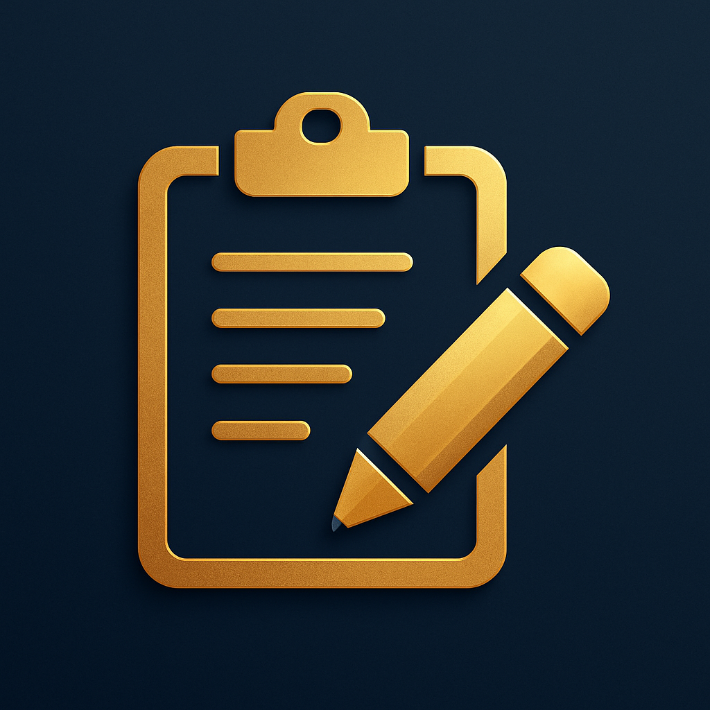
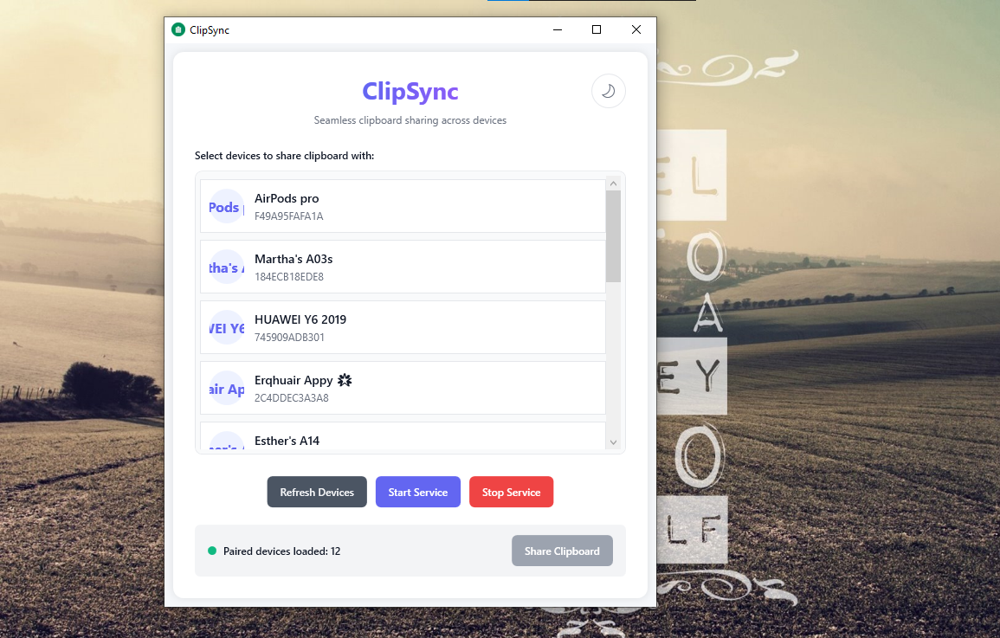
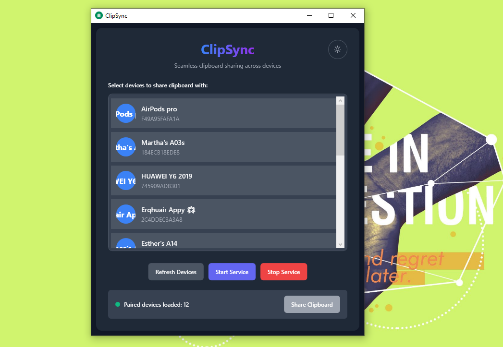
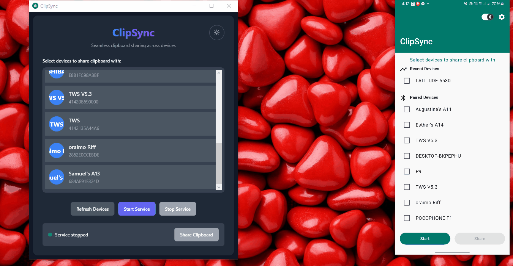

<div align="center">



# ClipSync

A Windows app that enables **seamless clipboard sharing** between Windows computers and Android devices over *Bluetooth*. **No more emailing yourself text.** Copy on one device, paste on the other. *Instant. 100% offline*

[](https://github.com/aubynsamuel/clipsync-windows)
[](LICENSE)
</div>

## Demo/Screenshots

<div align="center">

   
   
   

</div>

## 🚀 Features

- **Cross-Platform Clipboard Sharing**: Share clipboard text between Windows and Android devices
- **Real-time Sharing**: Instant clipboard sharing between devices
- **Multi-Device Support**: Connect and share with multiple devices simultaneously
- **Modern UI**: Clean, responsive interface with dark/light theme support
- **Bluetooth Connectivity**: Uses Bluetooth for secure, local sharing
- **Paired Devices Discovery**: Finds and lists paired Bluetooth devices

## 📋 Requirements

### System Requirements

- **OS**: Windows 10 / Windows 11
- **Framework**: .NET 9.0 Runtime 
- **Bluetooth**: Bluetooth adapter

### Android Companion App

- ClipSync Android - [Download on GitHub](https://github.com/aubynsamuel/clipsync-android/releases)

## 📦 Installation

### Option 1: Download Release (Recommended)

1. Go to the [Releases](https://github.com/aubynsamuel/clipsync-windows/releases) page
2. Download the latest `ClipSync-Windows-Setup.exe`
3. Run the installer and follow the setup wizard
4. Launch ClipSync from the Start Menu

### Option 2: Build from Source

1. **Prerequisites**:
   - .NET SDK 9.0+

2. **Clone and Build**:

   ```bash
   git clone https://github.com/aubynsamuel/clipsync-windows.git
   cd clipsync-windows
   dotnet restore
   dotnet build --configuration Release
   ```

3. **Run**:

   ```bash
   dotnet run --project ClipSyncWindows.csproj
   ```

## 🔧 Setup & Usage

### Initial Setup

1. **Enable Bluetooth**: Ensure Bluetooth is enabled on your Windows computer
2. **Pair Devices**: Pair your Android device with your Windows computer through Windows/Android Settings
3. **Install Android App**: [Install the ClipSync Android companion app](https://github.com/aubynsamuel/clipsync-android/releases)
4. **Launch ClipSync**: Start the ClipSync Windows application

### Using ClipSync

#### Starting the Service

1. Click **"Start Service"** to begin listening for connections
2. The status will show "Service: Listening for bluetooth devices..."

#### Sharing from Windows to Android

1. Open the Android app and press Start to listen on Android
2. Copy any text to your Windows clipboard
3. Select target device(s) from the devices list
4. Click **"Share Clipboard"** to send content to selected devices

#### Receiving

- When the other device sends clipboard content, it will automatically appear in your Windows clipboard
- A notification will confirm successful receipt

## 🔒 Security & Privacy

- **Fully Local**: All data stays on your device
- **No Cloud or Internet**: Fully offline
- **Encrypted Transmission**: Uses Bluetooth's built-in encryption
- **Paired Devices Only**: Prevents unauthorized access
- **No Data Storage**: Clipboard data is never stored

## 🐛 Troubleshooting

### Common Issues

#### No devices found

- Ensure Bluetooth is enabled on both devices
- Verify devices are paired in Windows Settings
- Try refreshing the devices list

#### Connection failed

- Check if Android app is running and listening
- Restart Bluetooth on both devices
- Re-pair devices if necessary

### Getting Help

- Check the [Issues](https://github.com/aubynsamuel/clipsync-windows/issues) page
- Create a new issue with detailed error information
- Include Windows version and Bluetooth adapter details if possible

## 🤝 Contributing

We welcome contributions

1. Fork the repository
2. Create a feature branch: `git checkout -b feature-name`
3. Make your changes and test thoroughly
4. Submit a pull request with a clear description

## 📄 License

This project is licensed under the MIT License - see the [LICENSE](LICENSE) file for details.

## 🙏 Acknowledgments

- [InTheHand.Net.Bluetooth](https://github.com/inthehand/32feet) for Bluetooth connectivity
- [Newtonsoft.Json](https://www.newtonsoft.com/json) for JSON serialization

---

Made with ❤️ for seamless cross-platform productivity
